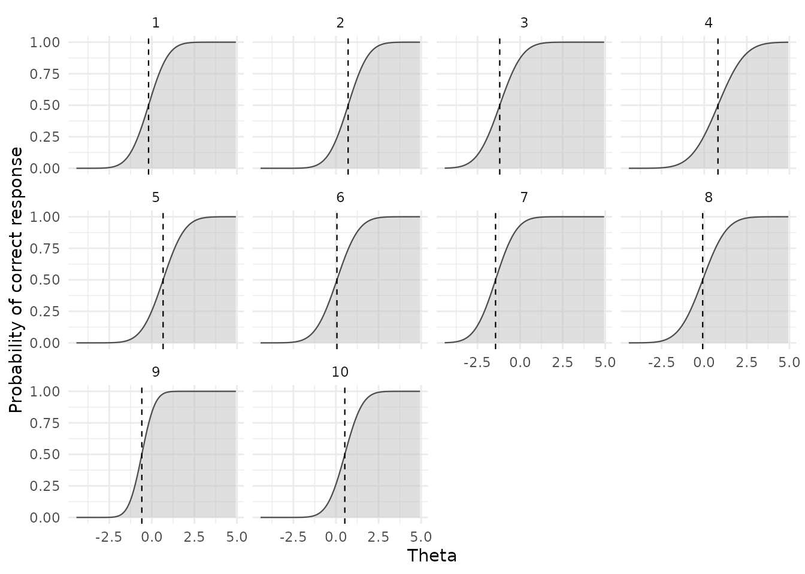
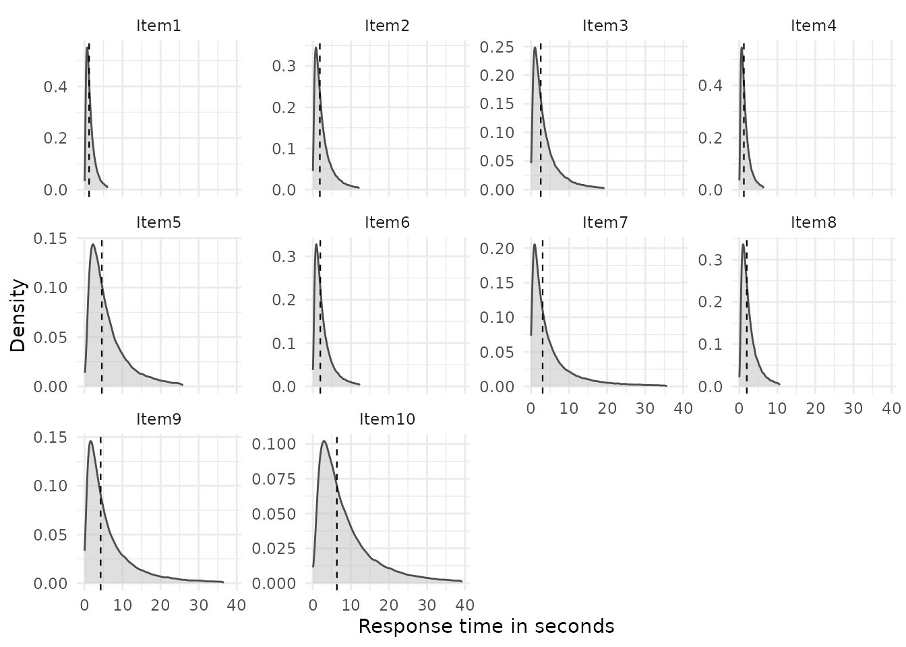
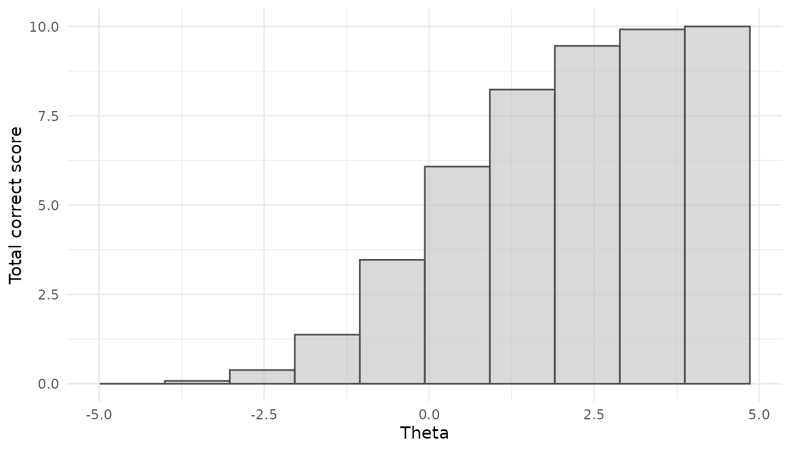
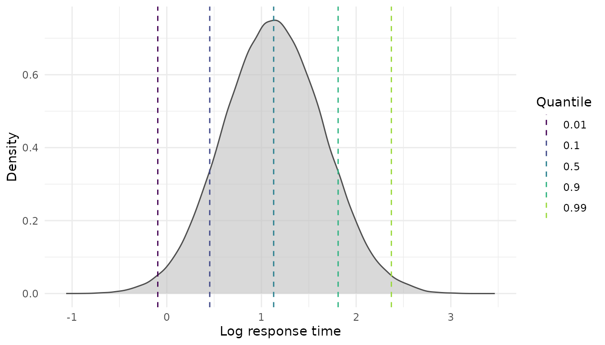

# sspLNIRT

``` r
# install devtools if needed
if (!requireNamespace("devtools")) {install.packages("devtools")}

# install from GitHub
devtools::install_github("sebastian-lortz/sspLNIRT")
```

``` r
# load sspLNIRT package
library(sspLNIRT)
```

## Overview

The `sspLNIRT` package provides sample size planning tools for item
calibration under the Joint Hierarchical Model (JHM; van der Linden,
2007), combining a 2-parameter normal ogive model for response accuracy
with a log-normal model for response times, estimated via Gibbs sampling
through the `LNIRT` package (Fox et al., 2023).

The core question is: *What is the minimum sample size to achieve a
desired accuracy of item parameter estimates, given the assumed
data-generating process?* Accuracy is defined as the root mean squared
error (RMSE) of a target item parameter (e.g., discrimination $\alpha$)
falling below a user-specified threshold, averaged across items and
Monte Carlo iterations.

For a detailed description of the method, simulation model, and
precomputed design conditions, see the accompanying manuscript.

## Step 1: Specify the data-generating process

The first step is to specify the assumed data-generating process. This
includes the item and person parameter distributions that define the
simulation model. The following example uses a 10-item test ($K = 10$)
with the following specifications:

- Mean item parameters: $\mu_{\alpha} = 1$, $\mu_{\beta} = 0$,
  $\mu_{\phi} = 0.5$, $\mu_{\lambda} = 1$, with standard deviations of
  $0.2$, $1.0$, $0.2$, and $0.5$, respectively.
- Item difficulty ($\beta$) and time intensity ($\lambda$) correlate at
  $r = 0.4$; all other item parameter correlations are zero.
- Mean residual variance on the log scale:
  $\mu_{\sigma^{2}} = \ln(0.6)$, with zero variance across items.
- Person parameters follow a bivariate standard normal distribution with
  ability–speed correlation $\rho = 0.4$.

``` r
sim.mod.args <- list(
  K              = 10,
  mu.person      = c(0, 0),
  mu.item        = c(1, 0, .5, 1),
  meanlog.sigma2 = log(0.6),
  sdlog.sigma2   = 0,
  cov.m.person   = matrix(c(1,   0.4,
                             0.4, 1), ncol = 2, byrow = TRUE),
  cov.m.item     = matrix(c(1, 0,   0,   0,
                             0, 1,   0,   0.4,
                             0, 0,   1,   0,
                             0, 0.4, 0,   1), ncol = 4, byrow = TRUE),
  sd.item        = c(.2, 1, .2, .5),
  cor2cov.item   = TRUE
)
```

### Inspecting implied distributions

Before committing to a design, it is useful to inspect the implied
response accuracy and response time distributions. This helps evaluate
whether the assumed data-generating process produces plausible score and
time distributions for the intended application.

At the item level,
[`plot_RA()`](https://sebastian-lortz.github.io/sspLNIRT/reference/plot_RA.md)
shows the distribution of implied response probabilities across items,
and
[`plot_RT()`](https://sebastian-lortz.github.io/sspLNIRT/reference/plot_RT.md)
shows within-item response time distributions:

``` r
do.call(plot_RA, c(list(level = "item", by.theta = TRUE, N = 1e5), sim.mod.args))
```



``` r
do.call(plot_RT, c(list(level = "item", logRT = FALSE, N = 1e5), sim.mod.args))
```



Additional views are available at the person level, showing
total-correct score distributions and person-level (log-)RT
distributions:

``` r
do.call(plot_RA, c(list(level = "person", by.theta = TRUE, N = 1e5), sim.mod.args))
```



``` r
do.call(plot_RT, c(list(level = "person", logRT = TRUE, N = 1e5), sim.mod.args))
```



Both functions allow users to inspect how the simulated RA and RT
distributions vary as a function of person ability and speed,
respectively. This enables researchers to interpret the assumed
data-generating process more accurately and facilitates making
appropriate design choices.

## Step 2: Determine the minimum sample size

### Using precomputed results

The package ships with precomputed minimum sample sizes across a
factorial grid of design conditions (see the manuscript for details). If
the assumed design is covered by this grid, results can be retrieved
instantly without running any simulations. Use
[`available_configs()`](https://sebastian-lortz.github.io/sspLNIRT/reference/available_configs.md)
to check whether your specification matches an available condition:

``` r
configs <- available_configs()
head(configs, 10)
#>    thresh out.par  K mu.alpha meanlog.sigma2 rho
#> 1    0.10     phi 30      1.4     -1.6094379 0.6
#> 2    0.20     phi 30      0.6      0.0000000 0.2
#> 3    0.05   alpha 10      1.0     -1.6094379 0.4
#> 4    0.20    beta 50      1.0     -1.6094379 0.4
#> 5    0.05   alpha 10      0.6     -0.5108256 0.6
#> 6    0.10   alpha 50      1.4     -0.5108256 0.6
#> 7    0.10    beta 30      1.4      0.0000000 0.4
#> 8    0.20  lambda 10      0.6     -0.5108256 0.4
#> 9    0.10    beta 10      1.4     -1.6094379 0.2
#> 10   0.10  lambda 10      0.6      0.0000000 0.6
```

The columns correspond to the design factors that were varied: `thresh`
(RMSE threshold), `out.par` (target item parameter), `K` (test length),
`mu.alpha` (mean item discrimination), `meanlog.sigma2` (log-scale mean
of $\sigma^{2}$), and `rho` (ability–speed correlation).

#### Planning for item discrimination ($\alpha$)

Suppose the researcher aims for a target accuracy of
$RMSE_{\xi}^{*} = 0.1$ for all item parameters
$\xi \in \{\alpha,\beta,\phi,\lambda\}$, because she is interested in an
accurate joint calibration of both the RA and the RT model. She begins
by retrieving the minimum sample size for item discrimination
($\alpha$):

``` r
res_alpha <- get_sspLNIRT(
  thresh         = 0.1,
  out.par        = "alpha",
  K              = 10,
  mu.alpha       = 1,
  meanlog.sigma2 = log(0.6),
  rho            = 0.4
)
summary(res_alpha$object)
#> ==================================================
#> 
#> Call: optim_sample()
#> 
#> Sample Size Optimization
#> --------------------------------------------------
#>   Minimum N:  639 
#>   Power curve N:  564 
#>   RMSE at minimum N:  0.09884139 
#>   Steps:  13 
#>   Time elapsed: 1.186907 hours 
#> 
#> Item Parameter MSEs:
#> --------------------------------------------------
#>          alpha     beta       phi    lambda   sigma2
#> RMSE  0.098841 0.092362  0.035406  0.033659 0.043612
#> MC SD 0.031066 0.027087  0.008124  0.008721 0.008937
#> Bias  0.002482 0.005544 -0.001633 -0.001883 0.020752
#> 
#> Person Parameter MSEs:
#> --------------------------------------------------
#>          theta      zeta
#> RMSE  0.459026  0.412612
#> MC SD 0.024429  0.039770
#> Bias  0.005937 -0.003958
#> 
#> Converged MC iterations at minimum N: 92 %
#> ---
```

The output reports the estimated minimum sample size $N_{\alpha}$
together with the estimated RMSE, Monte Carlo standard deviation of the
RMSE, and bias for all item and person parameters at $N_{\alpha}$. The
researcher checks whether the target accuracy is already achieved for
all item parameters at this sample size.

#### Continuing with remaining parameters

If the desired accuracy threshold has not been reached for all item
parameters at $N_{\alpha}$, the researcher continues the sample size
planning for the remaining parameters. She retrieves the minimum sample
size for item difficulty ($\beta$):

``` r
res_beta <- get_sspLNIRT(
  thresh         = 0.1,
  out.par        = "beta",
  K              = 10,
  mu.alpha       = 1,
  meanlog.sigma2 = log(0.6),
  rho            = 0.4
)
summary(res_beta$object)
#> ==================================================
#> 
#> Call: optim_sample()
#> 
#> Sample Size Optimization
#> --------------------------------------------------
#>   Minimum N:  569 
#>   Power curve N:  600 
#>   RMSE at minimum N:  0.09919063 
#>   Steps:  12 
#>   Time elapsed: 1.512638 hours 
#> 
#> Item Parameter MSEs:
#> --------------------------------------------------
#>          alpha      beta      phi    lambda   sigma2
#> RMSE  0.101245  0.099191 0.034784  0.037650 0.045637
#> MC SD 0.026370  0.035566 0.009574  0.010899 0.009412
#> Bias  0.002800 -0.000782 0.000935 -0.002178 0.021952
#> 
#> Person Parameter MSEs:
#> --------------------------------------------------
#>           theta      zeta
#> RMSE   0.462287  0.423354
#> MC SD  0.025813  0.040762
#> Bias  -0.002605 -0.007314
#> 
#> Converged MC iterations at minimum N: 89 %
#> ---
```

If needed, she continues with the RT item parameters ($\phi$ and
$\lambda$):

``` r
res_phi <- get_sspLNIRT(
  thresh         = 0.1,
  out.par        = "phi",
  K              = 10,
  mu.alpha       = 1,
  meanlog.sigma2 = log(0.6),
  rho            = 0.4
)
summary(res_phi$object)
#> ==================================================
#> 
#> Call: optim_sample()
#> 
#> Sample Size Optimization
#> --------------------------------------------------
#>   Minimum N:  89 
#>   Power curve N:  90 
#>   RMSE at minimum N:  0.09781307 
#>   Steps:  13 
#>   Time elapsed: 36.17354 mins 
#> 
#> Item Parameter MSEs:
#> --------------------------------------------------
#>          alpha      beta       phi    lambda   sigma2
#> RMSE  0.183284  0.238207  0.097813  0.104905 0.184661
#> MC SD 0.048650  0.086618  0.031401  0.032902 0.032502
#> Bias  0.015704 -0.005407 -0.013453 -0.012235 0.154623
#> 
#> Person Parameter MSEs:
#> --------------------------------------------------
#>           theta      zeta
#> RMSE   0.467960  0.443592
#> MC SD  0.045935  0.053863
#> Bias  -0.013585 -0.011045
#> 
#> Converged MC iterations at minimum N: 98 %
#> ---
```

``` r
res_lambda <- get_sspLNIRT(
  thresh         = 0.1,
  out.par        = "lambda",
  K              = 10,
  mu.alpha       = 1,
  meanlog.sigma2 = log(0.6),
  rho            = 0.4
)
summary(res_lambda$object)
#> ==================================================
#> 
#> Call: optim_sample()
#> 
#> Sample Size Optimization
#> --------------------------------------------------
#>   Minimum N:  85 
#>   Power curve N:  87 
#>   RMSE at minimum N:  0.09669668 
#>   Steps:  13 
#>   Time elapsed: 52.92605 mins 
#> 
#> Item Parameter MSEs:
#> --------------------------------------------------
#>          alpha     beta       phi    lambda   sigma2
#> RMSE  0.171088 0.233903  0.100500  0.096697 0.189290
#> MC SD 0.045971 0.069932  0.026824  0.027443 0.034849
#> Bias  0.020595 0.025492 -0.010594 -0.002319 0.158314
#> 
#> Person Parameter MSEs:
#> --------------------------------------------------
#>          theta     zeta
#> RMSE  0.465766 0.443007
#> MC SD 0.045665 0.065834
#> Bias  0.018121 0.001673
#> 
#> Converged MC iterations at minimum N: 98 %
#> ---
```

#### Selecting the planning sample size

To ensure that the target accuracy is expected to be met for all item
parameters simultaneously, the researcher conservatively selects the
largest minimum sample size across all four parameters:

``` r
N_all <- c(
  alpha  = res_alpha$object$N.min,
  beta   = res_beta$object$N.min,
  phi    = res_phi$object$N.min,
  lambda = res_lambda$object$N.min
)
N_all
#>  alpha   beta    phi lambda 
#>    639    569     89     85

# select the largest
N_star <- max(N_all)
N_star
#> [1] 639

# identify which parameter determined N*
res_final <- list(
  alpha  = res_alpha,
  beta   = res_beta,
  phi    = res_phi,
  lambda = res_lambda
)[[names(which.max(N_all))]]
```

The researcher selects $N^{*} =$ 639 as the planning sample size,
determined by the parameter alpha.

### Using `optim_sample()` for custom designs

When the assumed design is not covered by the precomputed grid, the
researcher can run the sample size optimization directly using
[`optim_sample()`](https://sebastian-lortz.github.io/sspLNIRT/reference/optim_sample.md).
This uses a bisection algorithm that iteratively evaluates
[`comp_rmse()`](https://sebastian-lortz.github.io/sspLNIRT/reference/comp_rmse.md)
at candidate sample sizes until the RMSE of the target parameter crosses
the threshold. Each step runs a full Monte Carlo simulation study with
`iter` replications.

``` r
# Not run — computationally intensive (several hours)
library(future)
plan(multisession, workers = 4)

optim.args <- list(
  thresh       = 0.1,
  range        = c(50, 2000),
  out.par      = "alpha",
  iter         = 100,
  XG           = 6000,
  burnin       = 20,
  rhat         = 1.05,
  keep.err.dat = FALSE,
  seed         = 1234
)

res_custom <- do.call(optim_sample, c(sim.mod.args, optim.args))
summary(res_custom)
```

For a single evaluation at a fixed $N$ (without optimization), use
[`comp_rmse()`](https://sebastian-lortz.github.io/sspLNIRT/reference/comp_rmse.md):

``` r
# Not run — computationally intensive
rmse.args <- list(
  N            = 200,
  iter         = 100,
  XG           = 6000,
  burnin       = 20,
  rhat         = 1.05,
  keep.err.dat = TRUE,
  seed         = 1234
)

rmse_result <- do.call(comp_rmse, c(rmse.args, sim.mod.args))
summary(rmse_result)
```

## Step 3: Inspect and visualize

### Power curve

The power curve shows how RMSE decreases with sample size, fitted as a
log-log regression through the optimization trace. It can be used to
extrapolate the required $N$ for the target threshold. Because the
power-law curve pools information from all bisection steps,
$N_{\text{curve}}^{*}$ tends to have less variance than $N^{*}$ from the
bisection optimizer, but may have more bias. The plot can be used to
further inspect the relation between sample size and accuracy.

``` r
plot_power_curve(res_final$object, thresh = 0.1)
```


The left panel shows the log-log fit; the right panel the original
scale. The dashed line marks the threshold, the dotted line the
extrapolated $N$.

### Estimation accuracy

[`plot_estimation()`](https://sebastian-lortz.github.io/sspLNIRT/reference/plot_estimation.md)
shows how RMSE or bias varies across the range of true parameter values
at the selected sample size $N^{*}$. This is useful for identifying
regions of the parameter space where estimation is more or less precise
— for instance, whether items with extreme difficulty values are
estimated less accurately.

``` r
plot_estimation(res_final$object, pars = "item", y.val = "rmse")
#> `geom_smooth()` using formula = 'y ~ x'
```


``` r
plot_estimation(res_final$object, pars = "person", y.val = "rmse")
#> `geom_smooth()` using formula = 'y ~ x'
```


``` r
plot_estimation(res_final$object, pars = "item", y.val = "bias")
#> `geom_smooth()` using formula = 'y ~ x'
```


### Design configuration

The full set of generating parameters can be inspected via the `design`
element of the output:

``` r
str(res_final$design)
#> List of 19
#>  $ thresh        : num 0.1
#>  $ range         : num [1:2] 50 2000
#>  $ out.par       : chr "alpha"
#>  $ iter          : num 100
#>  $ K             : num 10
#>  $ mu.person     : num [1:2] 0 0
#>  $ mu.item       : num [1:4] 1 0 0.5 1
#>  $ meanlog.sigma2: num -0.511
#>  $ cov.m.person  : num [1:2, 1:2] 1 0.4 0.4 1
#>  $ cov.m.item    : num [1:4, 1:4] 1 0 0 0 0 1 0 0.4 0 0 ...
#>  $ sd.item       : num [1:4] 0.2 1 0.2 0.5
#>  $ cor2cov.item  : logi TRUE
#>  $ sdlog.sigma2  : num 0
#>  $ item.pars.m   : NULL
#>  $ XG            : num 6000
#>  $ burnin        : num 20
#>  $ seed          : num 311251
#>  $ rhat          : num 1.05
#>  $ keep.err.dat  : logi FALSE
#>  - attr(*, "class")= chr "sspLNIRT.design"
```

## Interactive Shiny application

The package includes a Shiny app for interactive exploration of
precomputed results. Users specify design conditions via the interface,
and the app retrieves the corresponding minimum sample size with summary
statistics and visualizations. Alternatively, users can specify their
own design condition, inspect the distribution visualizations, and
download the function call for use in R.

``` r
run_app()
```

## References

Fox, J.-P., Klotzke, K., & Simsek, A. S. (2023). R-package LNIRT for
joint modeling of response accuracy and times. *PeerJ Computer Science*,
*9*, e1232. <https://doi.org/10.7717/peerj-cs.1232>

van der Linden, W. J. (2007). A hierarchical framework for modeling
speed and accuracy on test items. *Psychometrika*, *72*(3), 287–308.
<https://doi.org/10.1007/s11336-006-1478-z>
